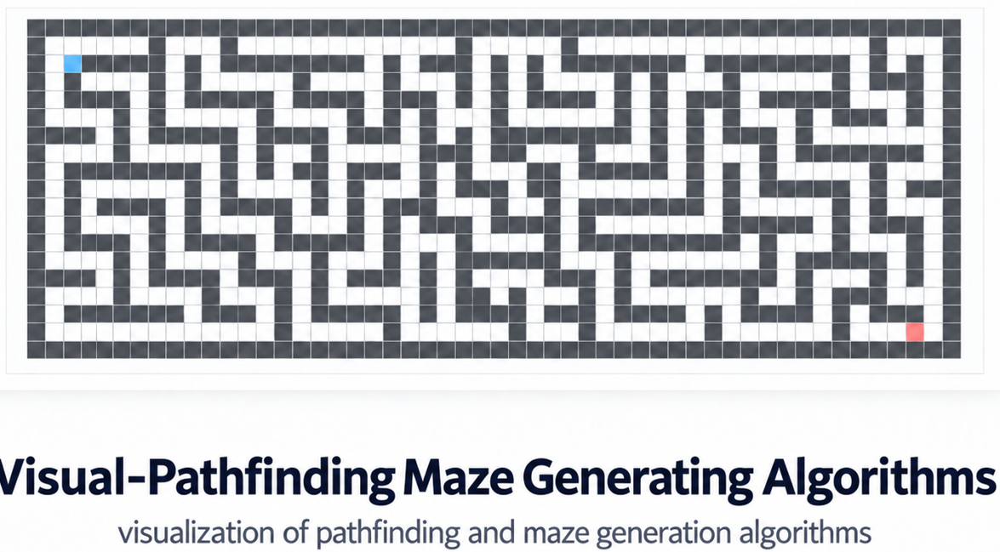

  

# Visual Pathfinding & Maze Generation Algorithms

## About

A visualization tool for exploring pathfinding and maze generation algorithms.

---

## Status

🚧 Demo version

Built mainly for larger screens.

---

## Grid Legend

 Start &nbsp;&nbsp;
 Finish &nbsp;&nbsp;
 Unvisited &nbsp;&nbsp;
 Visited &nbsp;&nbsp;
 Wall

---

---

## Features

- Pathfinding visualization
- Maze generation visualization
- Interactive grid
- Step-by-step algorithm behavior

---

## Algorithms

### Pathfinding
- Dijkstra's Algorithm
- Breadth-First Search (BFS)
- Depth-First Search (DFS)

### Maze Generation
- Recursive Division

---

## Notes

If the layout looks too large on your screen, try zooming out in the browser.
