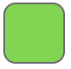

  

# Visual Pathfinding & Maze Generation Algorithms

Visualization of pathfinding and maze generation algorithms.

---

## Status

🚧 Demo version

Built mainly for larger screens.

---

## Grid Legend

 Start &nbsp;&nbsp;
 Finish &nbsp;&nbsp;
 Unvisited &nbsp;&nbsp;
 Visited &nbsp;&nbsp;
 Wall

## Demo

to-be-added

---

## About

This project visualizes different pathfinding and maze generation algorithms
to show how they work step by step in a simple and interactive way.

---

## Features

- Pathfinding visualization
- Maze generation visualization
- Interactive grid
- Step-by-step algorithm behavior

---

## Algorithms

### Pathfinding
- A*
- Dijkstra
- Breadth-First Search

### Maze Generation
- Recursive Backtracking
- Randomized algorithms

---

## Notes

If the layout looks too large on your screen, try zooming out in the browser.
